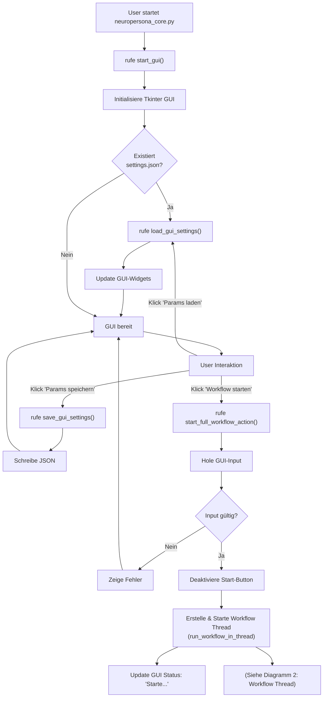
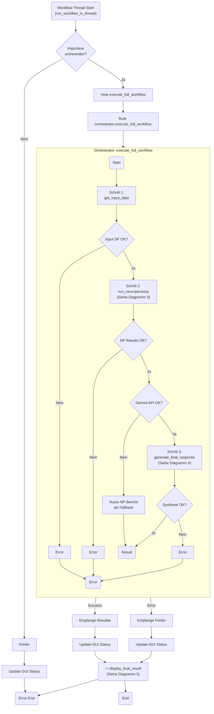
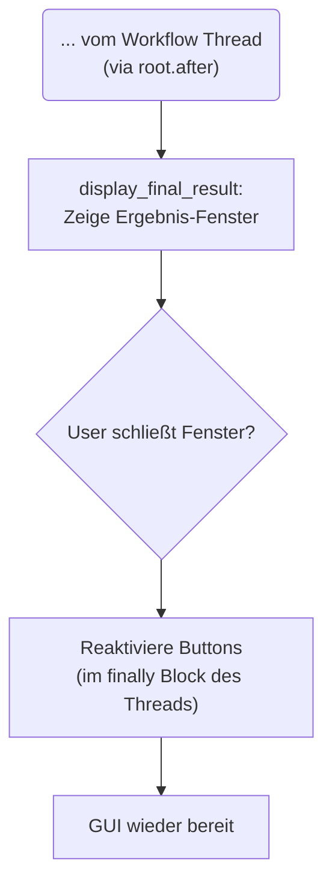

**Diagramm 1: GUI & Workflow-Start**



**Diagramm 2: Workflow Thread & Orchestrator (High-Level)**



**Diagramm 3: NeuroPersona Core Simulation (High-Level & Loop)**
*(Hier könntest du entscheiden, wie viel Detail du aus der `simulate_learning_cycle`-Schleife zeigen willst. Vielleicht nur die Hauptphasen A-O als Kette?)*

```mermaid
graph TD
    %% =============================================
    %% == 3. NeuroPersona Core Simulation         ==
    %% =============================================
    Call_run_np_simulation("Aufruf:<br>neuropersona_core.run_neuropersona_simulation") --> NP_Start(Start)
    NP_Start --> NP_Preprocess[preprocess_data]
    NP_Preprocess --> NP_InitNodes[initialize_network_nodes]
    NP_InitNodes --> NP_CallSimulateCycle[rufe simulate_learning_cycle]

    subgraph Simulation_Loop [Epochen-Schleife: simulate_learning_cycle]
        direction TB
        LoopInit["Init & Connect"] --> LoopStart["Epoche Start"]
        LoopStart --> Phases_A_to_O["Phasen A-O:<br>Reset, Input, Propagate,<br>Update Activation/Emotion/Values,<br>Modules, Learning, Decay,<br>Plasticity?, Consolidation?, Interpret"]
        Phases_A_to_O --> NextEpoch{"Nächste Epoche?"}
        NextEpoch -- Ja --> LoopStart
        NextEpoch -- Nein --> EndSimLoop["Ende Epochen"]
    end

    NP_CallSimulateCycle --> Simulation_Loop
    Simulation_Loop --> ReceiveSimResults["Empfange Ergebnisse"]
    ReceiveSimResults --> NP_GenerateReport["generate_final_report"] --> ReceiveReportAndStruct["Empfange Bericht & Struct"]
    ReceiveReportAndStruct --> CheckPlots{"Plots?"}
    CheckPlots -- Ja --> NP_GeneratePlots["Generiere Plots"] --> PostPlotActions
    CheckPlots -- Nein --> PostPlotActions
    PostPlotActions --> CheckSaveState{"Speichern?"}
    CheckSaveState -- Ja --> NP_SaveState[save_final_network_state] --> NP_CreateHTML[create_html_report]
    CheckSaveState -- Nein --> NP_CreateHTML
    NP_CreateHTML --> ReturnNPResults["Return Bericht & Struct"] --> NP_End(End)

    %% Ende dieses Diagramms
```



**Diagramm 4: Antwort-Synthese (Gemini)**

```mermaid
graph TD
    %% =============================================
    %% == 4. Antwort-Synthese (Gemini)            ==
    %% =============================================
    Call_generate_final_response("Aufruf:<br>orchestrator.generate_final_response") --> SynthStart(Start)

    subgraph Input_Sammlung [1. Inputs für Gemini sammeln]
        direction LR
        UserInput["Original User Prompt"]
        NPReport["NeuroPersona Bericht<br>(Kontext)"]
        NPStruct["Strukturierte NP Ergebnisse<br>(Dominanz, Modullevel...)"]
    end

    SynthStart --> Input_Sammlung

    subgraph Prompt_Erstellung [2. Prompt für Gemini erstellen]
        direction TB
        ExtractKeyResults["Extrahiere dominante Kat.,<br>Modullevel aus NP Struct"]
        AssemblePrompt["Baue Prompt zusammen:<br>1. User Prompt<br>2. NP Bericht (Kontext)<br>3. NP Extrakt (Kontext)<br>4. **Instruktionen** (Direkte Antwort,<br>Stil-Anpassung basierend<br>auf Modulleveln,<br>KEINE NP-Metadaten!)"]
        ExtractKeyResults --> AssemblePrompt
    end

    Input_Sammlung --> Prompt_Erstellung

    subgraph Gemini_Verarbeitung [3. Gemini API Verarbeitung (Blackbox)]
        direction TB
        %% Inputs zum Knoten bringen
        AssemblePrompt --> CallGeminiAPI["Sende Prompt an<br>Gemini API<br>(model.generate_content)"]

        %% Interne Verarbeitung (konzeptuell)
        InternalGeminiProcess{{"**Gemini LLM<br>(Inferenz)**<br><br><i>Verarbeitet Prompt:</i><br>- Versteht User-Frage<br>- Nutzt NP-Kontext<br>- Folgt Instruktionen<br>(Stil, Fokus, Verbote)<br>- Generiert Text"}}

        %% Verbindung
        CallGeminiAPI --> InternalGeminiProcess
    end

    Prompt_Erstellung --> Gemini_Verarbeitung


    subgraph Ergebnis_Handhabung [4. Ergebnis verarbeiten]
         direction TB
         HandleGeminiResponse{"Empfange Antwort<br>von API<br>(response Objekt)"}
         CheckResponse{"Antwort OK<br>& nicht blockiert?"}
         ExtractText["Extrahiere finalen<br>Antwort-Text<br>(response.text / .parts)"]
         FormatError["Formatiere<br>Fehlermeldung"]

         HandleGeminiResponse --> CheckResponse
         CheckResponse -- Ja --> ExtractText --> SynthEndSuccess(Finaler Antworttext)
         CheckResponse -- Nein --> FormatError --> SynthEndError(Fehlermeldung)
    end

    Gemini_Verarbeitung --> Ergebnis_Handhabung

    %% Verbindung zum vorherigen/nächsten Diagramm
    Call_generate_final_response --> SynthStart
    SynthEndSuccess --> ToDiagram2_Success["(Zurück zu Diagramm 2 - Erfolg)"]
    SynthEndError --> ToDiagram2_Error["(Zurück zu Diagramm 2 - Fehler)"]

    %% Ende dieses Diagramms
```

**Diagramm 5: GUI Post-Workflow**



