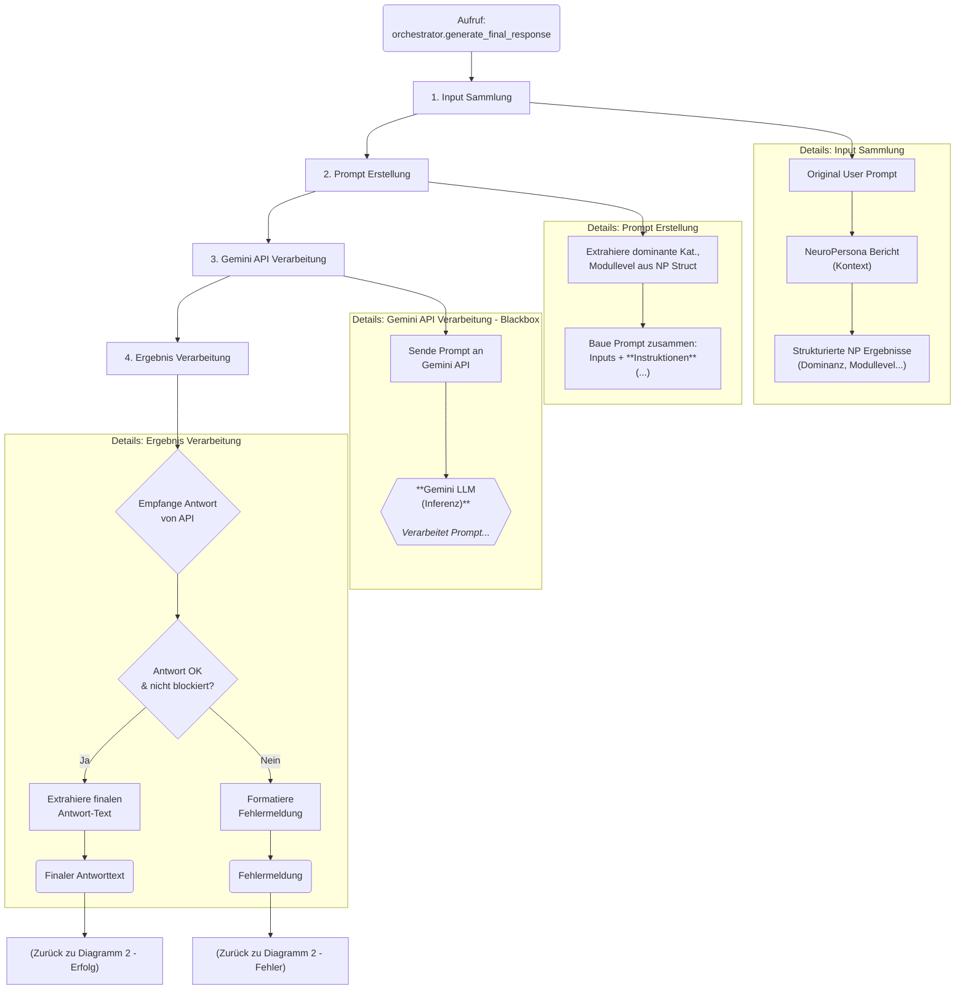

**Diagramm 1: GUI & Workflow-Start**

**Diagramm 2: Workflow Thread & Orchestrator (High-Level)**

**Diagramm 3: NeuroPersona Core Simulation (High-Level & Loop)**
*(Hier könntest du entscheiden, wie viel Detail du aus der `simulate_learning_cycle`-Schleife zeigen willst. Vielleicht nur die Hauptphasen A-O als Kette?)*

**Diagramm 4: Antwort-Synthese (Gemini)**

**Diagramm 5: GUI Post-Workflow**

