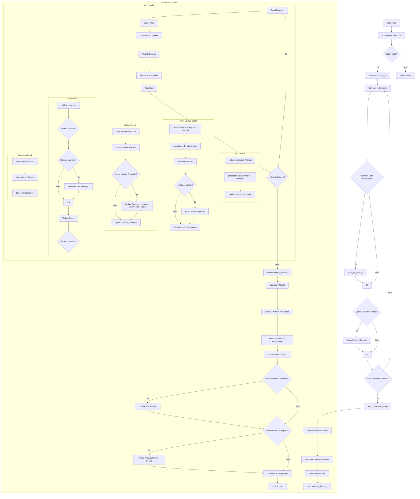

# NeuroPersona: A Bio-Inspired Cognitive Architecture Simulation with LLM Interpretation

**Version:** 1.1 (Datum: 09.04.2025)
**Author:** Ralf Krümmel/CipherCore

## Abstract

NeuroPersona ist eine Python-basierte Simulationsumgebung, die eine neuartige, bio-inspirierte kognitive Architektur modelliert. Es integriert Konzepte aus der Neurowissenschaft (exzitatorische/inhibitorische Neuronen, Hebb'sches Lernen, Weight Decay), der kognitiven Psychologie (modulare Verarbeitung, Gedächtnismechanismen) und der künstlichen Intelligenz (neuronale Netze, emergentes Verhalten). Das Kernziel ist nicht primär die punktgenaue Vorhersage, sondern die Simulation eines dynamischen, lernenden Systems, das komplexe Muster in Eingabedaten (z.B. Zeitreihen, Umfragedaten) durch das Zusammenspiel spezialisierter kognitiver Module und adaptiver neuronaler Verbindungen verarbeitet und repräsentiert. Das System zeichnet sich durch seine Fähigkeit aus, relevante Merkmale in den Daten durch emergente Prozesse zu identifizieren, auch wenn die genauen internen Abläufe nicht vollständig deterministisch oder transparent sind, ähnlich wie bei biologischen Gehirnen.
**Eine Schlüsselkomponente ist die optionale Integration des Google Gemini Large Language Models (LLM), das die komplexen Simulationsergebnisse kontextualisiert, interpretiert und in einem detaillierten, benutzerorientierten Bericht aufbereitet.**

## Core Concepts & Philosophy

Die Entwicklung von NeuroPersona basiert auf folgenden Leitgedanken:

1.  **Bio-Inspiration:** Die Architektur lehnt sich an die modulare und vernetzte Struktur des menschlichen Gehirns an. Sie verwendet unterschiedliche Neuronentypen und neurobiologisch plausible Lern- und Vergessensmechanismen.
2.  **Modularität & Spezialisierung:** Anstatt eines monolithischen Netzwerks werden spezialisierte "kognitive Module" (z.B. für Kreativität, Kritik, Emotion, Metakognition) eingesetzt, die interagieren und zur Gesamtverarbeitung beitragen.
3.  **Emergentes Verhalten:** Das System ist so konzipiert, dass komplexe und potenziell "intelligente" Verhaltensweisen nicht explizit programmiert, sondern aus den Interaktionen der Komponenten und den Lernregeln über die Zeit *emergieren*.
4.  **Dynamik & Adaptivität:** Das Netzwerk ist kein statisches System. Verbindungsstärken (Gewichte) und Aktivierungen ändern sich kontinuierlich basierend auf Input, internen Zuständen und Lernprozessen (Hebbian Learning, Decay, Reward).
5.  **Akzeptanz von Komplexität & "Black Box"-Aspekten:** Im Gegensatz zu vielen rein auf Optimierung und Erklärbarkeit ausgelegten KI-Modellen akzeptiert NeuroPersona eine gewisse Intransparenz der internen Prozesse als notwendiges Merkmal, um komplexeres, potenziell intuitiveres Verhalten zu ermöglichen. Der Fokus liegt auf der *konsistenten Leistungsfähigkeit* bei der Mustererkennung und Zustandsrepräsentation.
6.  **KI-Synergie (NeuroPersona + LLM):** Nutzung der Stärken beider Welten – die tiefe, emergente Mustererkennung von NeuroPersona und die kontextsensitive Interpretations- und Kommunikationsfähigkeit eines LLM (Gemini) zur Erstellung aussagekräftiger Analysen.

## System Architecture

Das NeuroPersona-Netzwerk besteht aus mehreren Schlüsselkomponenten:

### 1. Nodes (Knoten)
*   **Basiseinheit:** Repräsentieren Neuronen oder Neuronengruppen.
*   **Attribute:** Jeder Knoten hat ein `label` (Name), eine `activation` (aktueller Zustand, 0-1), eine `activation_sum` (akkumulierter Input) und einen `neuron_type`.
*   **Neuron Types:** `excitatory`, `inhibitory`, `interneuron`. Zufällige Zuweisung basierend auf biologischen Verteilungen.
*   **Spezialisierungen:**
    *   **`Node`:** Standardknoten (z.B. Input-Schicht).
    *   **`MemoryNode`:** Repräsentiert Kategorien/Konzepte. Attribute: `memory_type` (short/mid/long-term), `retention_time`, `promote()`-Mechanismus.

### 2. Connections (Verbindungen)
*   **Gerichtet & Gewichtet:** (`weight`, 0-1).
*   **Adaptivität:** Modifiziert durch Lern-/Vergessensmechanismen.

### 3. Cognitive Modules (Spezialisierte Knoten)
*   **`CortexCreativus`:** Ideen-Generierung.
*   **`SimulatrixNeuralis`:** Szenario-Simulation.
*   **`CortexCriticus`:** Ideen-Bewertung.
*   **`LimbusAffektus`:** Globaler emotionaler Zustand.
*   **`MetaCognitio`:** Dynamische Anpassung der Lernparameter.
*   **`CortexSocialis`:** Modellierung externer/sozialer Faktoren.

### 4. Netzwerkstruktur
*   **Input-Schicht:** Temporäre `Node`-Instanzen pro Datenpunkt.
*   **Kategorie-Schicht:** `MemoryNode`-Instanzen für Datenkategorien.
*   **Modul-Schicht:** Die sechs kognitiven Modul-Knoten.
*   **Verbindungen:** Input -> Kategorie, Kategorie <-> Modul (GUI-Gewicht: Modul->Kat), Modul <-> Modul.

### 5. LLM Interpretation Layer (Gemini Integration - NEU)
*   **Zweck:** Nimmt den von NeuroPersona generierten technischen Analysebericht und eine optionale Benutzeranfrage entgegen, um eine umfassende, kontextualisierte und menschenlesbare Interpretation zu erstellen.
*   **Komponente:** Nutzt die Google Generative AI API (`google-generativeai`) und ein geeignetes Gemini-Modell (z.B. `gemini-pro`).
*   **Workflow:** Wird nach Abschluss der NeuroPersona-Simulation aufgerufen.
*   **Output:** Ein detaillierter Markdown-Bericht, der die Ergebnisse im Kontext der Anfrage interpretiert (siehe `Output Interpretation`).

## Key Simulation Dynamics
1.  **Datenvorverarbeitung (`preprocess_data`):** Automatische Erkennung und Normalisierung (numerisch) oder Mapping (textuell) von Antworten.
2.  **Signalpropagation (`propagate_signal`):** Aktivierungsweiterleitung unter Berücksichtigung von Gewichten, Neuronentypen und Rauschen.
3.  **Aktivierungsberechnung:** Anwendung von `sigmoid`, Modulation durch Emotion/Kontext.
4.  **Lernen & Adaptation:** Hebbian Learning, Weight Decay, Reward Learning.
5.  **Modul-Interaktion:** Ausführung spezialisierter Modulfunktionen und Rückkopplung ins Netzwerk.

## Features

*   **Grafische Benutzeroberfläche (GUI):** Tkinter/ttk zur Parametereinstellung.
*   **Parameter-Persistenz:** Speichern/Laden von GUI-Einstellungen (`gui_settings.json`).
*   **Modell-Persistenz:** Speichern/Laden des NeuroPersona-Kernnetzwerkzustands (`neuro_persona_model.json`).
*   **NeuroPersona HTML-Bericht:** Automatisierte Generierung (`marktanalyse_pro.html`) mit technischer Zusammenfassung, regelbasierter Prognose, Verlauf und Plots.
*   **Dynamische Visualisierung:** Plots (`plots/`-Ordner) zu Aktivierungen, Gewichten und Netzwerkdynamiken.
*   **LLM-gestützte Interpretation (NEU):**
    *   Eingabefeld in der GUI für spezifische Analyse-Prompts/Fragen.
    *   Integration mit Google Gemini zur Generierung eines detaillierten, kontextualisierten Analyseberichts basierend auf den NeuroPersona-Ergebnissen und dem Benutzer-Prompt.
    *   Anzeige des Gemini-Berichts in einem separaten Fenster.
    *   Optionale Speicherung des Gemini-Berichts (`gemini_analyse_bericht.txt`).

## Usage

### Prerequisites

*   Python 3.x
*   **Google Gemini API Key:**
    *   Besorgen Sie sich einen API Key über [Google AI Studio](https://aistudio.google.com/).
    *   **WICHTIG:** Setzen Sie den Key als Umgebungsvariable `GEMINI_API_KEY`. **Speichern Sie den Key niemals direkt im Code!**
        *   Windows (Cmd): `set GEMINI_API_KEY=DEIN_API_KEY`
        *   Windows (PowerShell): `$env:GEMINI_API_KEY="DEIN_API_KEY"`
        *   Linux/macOS: `export GEMINI_API_KEY='DEIN_API_KEY'`
*   Erforderliche Python-Bibliotheken:
    *   `google-generativeai` **(NEU)**
    *   `pandas`
    *   `numpy`
    *   `matplotlib`
    *   `tqdm`
    *   `seaborn` (optional)
    *   `networkx` (optional)
    *   Standardbibliotheken: `tkinter`, `json`, `os`, `time`, `random`, `threading`, `collections`, `itertools`.

    Installation via `pip`:
    ```bash
    pip install google-generativeai pandas numpy matplotlib tqdm seaborn networkx
    # Oder über requirements.txt (falls erstellt)
    # pip install -r requirements.txt
    ```
    (Hinweis: `tkinter` ist i.d.R. enthalten, ggf. `python3-tk` nachinstallieren).

### Running the Simulation

1.  Stellen Sie sicher, dass `data.csv` vorhanden und korrekt formatiert ist.
2.  **Setzen Sie die `GEMINI_API_KEY` Umgebungsvariable.**
3.  Führen Sie das Skript aus:
    ```bash
    python neuropersona.py
    ```
4.  Die GUI wird gestartet.
5.  Passen Sie die Simulationseinstellungen und Modul-Kategorie-Gewichte an.
6.  Geben Sie eine spezifische Frage oder einen Analysefokus in das Feld "Analyse-Prompt für Gemini" ein. Wenn Sie dieses Feld leer lassen oder nur der Platzhaltertext enthalten ist, wird keine Gemini-Analyse durchgeführt.
7.  Optional: Speichern/Laden Sie GUI-Einstellungen.
8.  Starten Sie die Simulation ("Simulation starten").
9.  Nach Abschluss der NeuroPersona-Simulation und der Plot-Generierung:
    *   Der technische HTML-Bericht wird erstellt.
    *   Die Plots werden angezeigt.
    *   **Wenn ein Gemini-Prompt eingegeben wurde:** Die Gemini API wird aufgerufen. Bei Erfolg wird der generierte Bericht in einem neuen Fenster angezeigt und optional als `gemini_analyse_bericht.txt` gespeichert. Das Statuslabel in der GUI informiert über den Fortschritt.

### Input Data (`data.csv`)
*   Spalten: `Frage`, `Antwort` (Text oder Numerisch), `Kategorie`.

## Configuration
*   **Primäre Parameter (GUI):** Lernrate, Decay Rate, Reward Interval, Epochen, Modul-Kategorie-Gewichte, **Gemini-Prompt (NEU)**.
*   **Sekundäre Parameter (Code):** Dateinamen (`MODEL_FILENAME`, `SETTINGS_FILENAME`, `GEMINI_REPORT_FILENAME` **NEU**), `DEFAULT_*` Werte, Modul-interne Parameter, Noise Level.
*   **Externe Konfiguration:** `GEMINI_API_KEY` Umgebungsvariable **(NEU/WICHTIG)**.

## Output Interpretation

Die Simulation erzeugt mehrere Ausgaben:

1.  **NeuroPersona HTML Report (`marktanalyse_pro.html`):** Enthält die *technische* Zusammenfassung der Simulation, die *regelbasierte* Prognose, den Aktivierungsverlauf und Plots. Dient als Basis für die Gemini-Analyse.
2.  **Gemini Analyse Bericht (Fenster & optional `gemini_analyse_bericht.txt`) (NEU):**
    *   Ein **detaillierter, kontextualisierter Bericht**, der von Gemini generiert wird.
    *   Interpretiert die NeuroPersona-Ergebnisse im Licht der **Benutzeranfrage** (falls gestellt).
    *   Bietet eine tiefere Analyse, mögliche Implikationen und Begründungen, die über die einfachen Regeln des HTML-Reports hinausgehen.
    *   **Dies ist typischerweise der primäre Bericht für die inhaltliche Analyse.**
3.  **Plots (`plots/`):** Visualisieren die interne Dynamik des NeuroPersona-Netzwerks.
4.  **Gespeichertes Modell (`neuro_persona_model.json`):** Finaler Zustand des NeuroPersona-Netzwerks.
5.  **Gespeicherte Einstellungen (`gui_settings.json`):** GUI-Parameter zur Reproduktion.
6.  **Konsolenausgaben:** Fortschritt, Warnungen, Debug-Infos, textueller NeuroPersona-Bericht.

## Discussion: Emergent Behavior and Interpretability
Ein zentrales Merkmal von NeuroPersona ist das Auftreten von **emergentem Verhalten**. Die komplexen Interaktionen [...] führen zu einer Netzwerkdynamik, die nicht immer vollständig [...] vorhersagbar ist.

Beobachtungen [...] deuten darauf hin, dass das System in der Lage ist, **konsistent dominante Merkmale oder Muster** [...] zu identifizieren [...].

Diese Fähigkeit zur **Musteridentifikation durch Emergenz** wird als Stärke des Modells betrachtet [...]. Die **Synergie mit dem Gemini LLM (NEU)** ermöglicht es, diese komplexen, emergenten Ergebnisse in einen verständlichen und kontextbezogenen Rahmen zu übersetzen, was die Lücke zwischen der "Black Box"-Dynamik und der menschlichen Interpretation schließt.

**Limitations:**
*   **Interpretationslogik (HTML):** Die *regelbasierte* Prognose im HTML-Report ist rudimentär. **Die tiefere Interpretation erfolgt durch Gemini.**
*   **Gemini-Abhängigkeit (NEU):** Die Qualität der LLM-Interpretation hängt von der Qualität des Gemini-Modells, dem Prompting und der Verfügbarkeit der API ab. Fehler oder ungenaue Aussagen des LLM sind möglich.
*   **Prompt Engineering (NEU):** Die Formulierung der Benutzeranfrage im Gemini-Prompt kann das Ergebnis der LLM-Analyse erheblich beeinflussen.
*   **Modul-Sensitivität:** Einfluss der Module oft moderat.
*   **Erklärbarkeit (NeuroPersona):** Kausalanalyse der Emergenz bleibt schwierig.
*   **Skalierbarkeit:** Nicht für massive Datenmengen optimiert.
*   **API Kosten (NEU):** Die Nutzung der Gemini API kann Kosten verursachen.

## Future Directions
*   **Verbessertes Prompting für Gemini (NEU):** Systematische Untersuchung und Optimierung der Prompts, die an Gemini gesendet werden, um die Qualität und Konsistenz der Berichte zu maximieren.
*   **Integration von Feedback (NEU):** Möglichkeit für Benutzer, Feedback zur Gemini-Analyse zu geben, das potenziell zur Verbesserung zukünftiger Prompts genutzt werden könnte.
*   **Differenziertere Regel-Logik (HTML):** Auch wenn Gemini interpretiert, könnte die Basis-Prognose im HTML-Report verbessert werden.
*   Erhöhung des Moduleinflusses.
*   Alternative Lernregeln.
*   Parameteroptimierung.
*   Vergleichsstudien.
*   Erweiterung der Modulfunktionalitäten.

## License
---
## Systemaufbau / Netzwerkstruktur




## FAQ (Frequently Asked Questions)

**Q1: Was ist NeuroPersona und was macht es besonders?**
A: NeuroPersona ist eine Simulationsumgebung, die eine bio-inspirierte kognitive Architektur nachbildet. Es kombiniert Elemente aus Neurowissenschaft (Neuronentypen, Hebb'sches Lernen), kognitiver Psychologie (Module, Gedächtnis) und KI (neuronale Netze). Besonders ist die Integration spezialisierter kognitiver Module und die Fähigkeit, durch komplexe, emergente Prozesse Muster in Daten zu erkennen, ähnlich einer Intuition. Es fokussiert auf die *Repräsentation* von Datenmustern im Netzwerkzustand, weniger auf reine Vorhersagegenauigkeit nach klassischen Metriken. Die optionale Gemini-Integration ermöglicht eine tiefere, kontextbezogene Interpretation der Ergebnisse.

**Q2: Für wen ist dieses Modell gedacht?**
A: NeuroPersona richtet sich an Forscher, Entwickler und Enthusiasten, die an alternativen KI-Architekturen, bio-inspirierter KI, kognitiver Modellierung und der Untersuchung emergenten Verhaltens interessiert sind. Es ist auch für Anwender nützlich, die eine andere Perspektive auf die Analyse von Daten (z.B. Zeitreihen, Umfragen) gewinnen möchten, ergänzt durch eine LLM-Interpretation.

**Q3: Welche Art von Daten benötigt NeuroPersona?**
A: Es benötigt eine CSV-Datei (standardmäßig `data.csv`) mit den Spalten `Frage` (Text), `Antwort` (kann Text oder Zahl sein) und `Kategorie` (Text, der die Antwort gruppiert). Die `preprocess_data`-Funktion normalisiert numerische Antworten pro Kategorie und wandelt bekannte Textantworten um.

**Q4: Wie führe ich die Simulation aus?**
A: 1. Stellen Sie sicher, dass Python und die benötigten Bibliotheken (inkl. `google-generativeai`, falls Gemini genutzt wird) installiert sind. 2. Legen Sie Ihre `data.csv` im selben Verzeichnis ab. 3. **WICHTIG (für Gemini):** Setzen Sie Ihren Google Gemini API Key als Umgebungsvariable `GEMINI_API_KEY`. 4. Führen Sie `python neuropersona.py` in der Konsole aus. 5. Passen Sie Parameter in der GUI an. 6. Geben Sie optional einen Analyse-Prompt für Gemini ein. 7. Klicken Sie auf "Simulation starten".

**Q5: Was bedeuten die wichtigsten GUI-Parameter?**
A:
*   **Lernrate:** Wie stark Gewichte durch Hebb'sches Lernen angepasst werden. Höher = schnelleres Lernen, aber Gefahr von Instabilität.
*   **Decay Rate:** Wie schnell Gewichte passiv verfallen (Vergessen). Höher = stärkeres Vergessen.
*   **Reward Interval:** Nach wie vielen Epochen zufällige Verbindungen zu einer Zielkategorie verstärkt werden.
*   **Epochen:** Wie oft die gesamten Daten durchlaufen werden. Mehr Epochen = mehr Lernzeit.
*   **Modul-Kategorie Gewichte:** *Initiale* Stärke der Verbindung *von* einem Modul *zu* einer Kategorie. Beeinflusst, wie stark ein Modul potenziell eine Kategorie beeinflussen *könnte*, *wenn* das Modul aktiv ist.

**Q6: Wie interpretiere ich den HTML-Bericht vs. den Gemini-Bericht?**
A:
*   **HTML-Bericht:** Liefert eine *technische* Zusammenfassung der Simulation (finale Aktivierungen, häufigste dominante Kategorie) und eine *sehr einfache, regelbasierte* Prognose. Er zeigt den rohen Endzustand des NeuroPersona-Netzwerks.
*   **Gemini-Bericht:** Liefert eine *tiefere, kontextualisierte Interpretation*. Er berücksichtigt Ihre spezifische Analysefrage (falls gestellt), bezieht die verschiedenen Simulationsergebnisse (inkl. Modulzustände) aufeinander und formuliert eine ausführlichere, begründete Einschätzung und Handlungsempfehlung. **Dies ist i.d.R. der aussagekräftigere Bericht für die inhaltliche Analyse.**

**Q7: Warum sind die Aktivierungen der kognitiven Module oft nur moderat (z.B. ~0.5)?**
A: Die Module erhalten ihren Input hauptsächlich indirekt von den Kategorie-Knoten über initial eher schwache Verbindungen. Selbst wenn die Kategorien stark aktiv sind, reicht dieser Input oft nicht aus, um die Module *extrem* stark zu aktivieren. Eine moderate Aktivierung zeigt jedoch, dass sie am Prozess beteiligt sind und interagieren. Ihr Einfluss ist vorhanden, aber nicht unbedingt dominant im Vergleich zum direkten Daten-Input an die Kategorien.

**Q8: Warum erhalte ich `NaN` (Not a Number) in den Ergebnissen?**
A: Dies deutet auf eine numerische Instabilität während der Simulation hin, oft verursacht durch zu hohe Lernraten. Wenn Gewichte oder Aktivierungssummen extrem groß werden, können Berechnungen (wie `sigmoid` oder Multiplikationen) zu `NaN` führen. **Lösung:** Reduzieren Sie die Lernrate deutlich (z.B. auf 0.1 oder 0.05) und/oder erhöhen Sie die Decay Rate leicht (z.B. 0.01).

**Q9: Warum lautet die (HTML-)Prognose "Abwarten" / "Abraten" / "Empfehlung"?**
A: Diese einfache Prognose im HTML-Bericht basiert *ausschließlich* auf einer fest im Code hinterlegten Regel, die nur die *finale dominante Kategorie* betrachtet (z.B. `IF Tiefstkurs_dominant THEN Abraten`, `IF Höchstkurs_dominant THEN Empfehlung`, `ELSE Abwarten`). Sie ist eine sehr simple Übersetzung des Endzustands. Der Gemini-Bericht liefert eine fundiertere Begründung.

**Q10: Was ist der "Analyse-Prompt für Gemini" und wie nutze ich ihn?**
A: Dies ist ein optionales Textfeld in der GUI. Hier können Sie eine spezifische Frage oder einen Fokus für die Analyse durch Gemini eingeben (z.B. "Analysiere das Risiko eines Kursrückgangs", "Fokus auf langfristiges Potenzial unter Berücksichtigung des Modulzustands", "Vergleiche die Bedeutung von Volumen vs. Schlusskurs"). Wenn Sie hier etwas eingeben, wird Gemini versuchen, seinen Bericht speziell darauf auszurichten. Lassen Sie es leer für eine allgemeinere Analyse der NeuroPersona-Ergebnisse.

**Q11: Benötige ich zwingend einen Gemini API Key?**
A: Nein. NeuroPersona funktioniert auch ohne Gemini. Sie erhalten dann den technischen HTML-Bericht und die Plots. Die Gemini-Integration zur tieferen Interpretation ist jedoch ein Kernfeature. Wenn Sie sie nutzen möchten, benötigen Sie einen API Key, der als Umgebungsvariable `GEMINI_API_KEY` gesetzt sein muss.

**Q12: Trifft NeuroPersona Zukunftsvorhersagen?**
A: Nein. NeuroPersona analysiert **historische Daten** und identifiziert darin dominante Muster und Beziehungen. Die resultierende "Prognose" (insbesondere im HTML-Bericht) ist eine Interpretation des *gelernten Zustands* basierend auf der Vergangenheit, keine Kristallkugel für die Zukunft. Der Gemini-Bericht kann zwar Implikationen für die Zukunft diskutieren, basiert aber ebenfalls auf der Analyse der historischen Simulation.

**Q13: Was sind die Grenzen des Modells?**
A: Wie jedes komplexe Modell hat auch NeuroPersona spezifische Charakteristika:
*   **Fokus auf Historische Muster:** Das Modell analysiert primär Muster in den ihm zur Verfügung gestellten historischen Daten. Es trifft keine Vorhersagen über zukünftige Ereignisse, die nicht aus diesen Mustern ableitbar sind.
*   **Externe Faktoren:** Ereignisse oder Informationen, die nicht in den Input-Daten enthalten sind (z.B. plötzliche Nachrichten, regulatorische Änderungen), werden nur begrenzt durch die allgemeine Dynamik oder spezifische Modul-Logik (wie `CortexSocialis`) berücksichtigt.
*   **Interpretationsschicht:** Die *Bedeutung* des finalen Netzwerkzustands wird durch nachgeschaltete Mechanismen interpretiert – entweder durch die einfachen Regeln im HTML-Report oder durch die kontextuelle Analyse von Gemini (falls genutzt). Die Qualität der finalen Aussage hängt auch von dieser Interpretation ab.
*   **Modul-Aktivität:** Während die Module interagieren, ist ihre Aktivierungsstärke oft moderat, was ihren differenzierten Einfluss auf das Endergebnis limitieren *kann*.
*   **Kausale Analyse:** Aufgrund der komplexen, emergenten Natur ist eine einfache Schritt-für-Schritt-Erklärung ("Warum genau *dieses* Gewicht zu *dieser* Aktivierung führte") oft nicht möglich (inhärenter "Black Box"-Aspekt).
*   **Skalierbarkeit:** Die aktuelle Implementierung ist nicht primär auf die Verarbeitung extrem großer Datensätze (> Millionen von Einträgen) oder Netzwerke ausgelegt.
*   **Gemini-Abhängigkeit (falls genutzt):** Die Qualität der LLM-Interpretation hängt vom LLM selbst, dem Prompt und der API-Verfügbarkeit ab.

**Q14: Kann ich den Ergebnissen vertrauen?**
A: Das Vertrauen in die Ergebnisse von NeuroPersona sollte auf dem Verständnis seiner Funktionsweise basieren:
*   **Vertrauen in Mustererkennung:** Umfangreiche Tests des Entwicklers haben gezeigt, dass das Modell **konsistent** in der Lage ist, **dominante Merkmale und Muster** in den analysierten historischen Daten zu identifizieren und diese im finalen Netzwerkzustand (insbesondere durch die Aktivierung der Kategorie-Knoten) abzubilden. Man kann also darauf vertrauen, dass das Modell relevante Aspekte der *Vergangenheit* hervorhebt.
*   **Vertrauen in Interpretation:** Die *Handlungsempfehlung* oder die *ausformulierte Analyse* (besonders durch Gemini) ist eine *Interpretation* dieses Zustands. Ihr Vertrauensgrad hängt von der Qualität der Interpretationsregeln bzw. der Fähigkeiten des LLMs und des Prompts ab.
*   **Keine Zukunftsgarantie:** Es ist entscheidend zu verstehen, dass das Modell historische Muster analysiert und *keine* garantierten Zukunftsprognosen liefert.
*   **Kontext ist entscheidend:** Die Ergebnisse sollten immer im Kontext der verwendeten Daten, der gewählten Parameter und idealerweise in Verbindung mit anderen Analysemethoden betrachtet werden.

**Q15: Wie *könnte* das Modell modifiziert oder erweitert werden?**
A: Rein technisch *könnten* Modifikationen Aspekte umfassen wie: das Hinzufügen neuer Module, das Ändern der Lernregeln, das Anpassen der Modul-Interaktionen, das Verbessern der Datenvorverarbeitung oder das Experimentieren mit der Interpretationslogik (sowohl regelbasiert als auch bei der LLM-Ansteuerung). **Ob und in welchem Rahmen das Modell jedoch modifiziert, geteilt oder für Beiträge geöffnet wird, liegt allein im Ermessen des ursprünglichen Entwicklers.**

## Glossar

*   **NeuroPersona:** Der Name dieser spezifischen Simulationsumgebung einer bio-inspirierten kognitiven Architektur.
*   **Node (Knoten):** Grundlegende Verarbeitungseinheit im Netzwerk, analog zu einem Neuron oder einer Neuronenpopulation.
*   **MemoryNode:** Ein spezialisierter Knotentyp, der eine Datenkategorie (z.B. "Schlusskurs", "Kundenzufriedenheit") repräsentiert und über Gedächtniseigenschaften (short/mid/long-term) verfügt.
*   **Cognitive Modules (Kognitive Module):** Spezialisierte Knoten (`CortexCreativus`, `SimulatrixNeuralis`, `CortexCriticus`, `LimbusAffektus`, `MetaCognitio`, `CortexSocialis`), die hypothetische Gehirnfunktionen modellieren und mit den Kategorien und untereinander interagieren.
*   **Activation (Aktivierung):** Ein numerischer Wert (typischerweise 0-1), der den aktuellen Aktivitätsgrad eines Knotens repräsentiert.
*   **Activation Sum:** Die Summe aller gewichteten Eingangssignale, die ein Knoten in einer Verarbeitungsphase erhält, bevor die Sigmoid-Funktion angewendet wird.
*   **Weight (Gewicht):** Ein numerischer Wert (typischerweise 0-1), der die Stärke einer Verbindung zwischen zwei Knoten angibt.
*   **Neuron Type:** Bestimmt, wie ein Knoten andere Knoten beeinflusst (`excitatory`: verstärkend, `inhibitory`: hemmend, `interneuron`: potenziell komplexer).
*   **Hebbian Learning:** Ein neurobiologisch inspiriertes Lernprinzip: Verbindungen zwischen gleichzeitig aktiven Knoten werden gestärkt ("Neurons that fire together, wire together").
*   **Weight Decay:** Ein Mechanismus, der die Gewichte aller Verbindungen über die Zeit passiv reduziert, um "Vergessen" zu simulieren und das Netzwerk stabil zu halten.
*   **Reward Learning:** Ein Mechanismus, der gezielt die Gewichte von Verbindungen verstärkt, die zu einer (zufällig) als positiv bewerteten Kategorie führen.
*   **Emergent Behavior (Emergentes Verhalten):** Komplexe Verhaltensmuster oder Eigenschaften des Gesamtsystems, die sich aus den Interaktionen seiner einfacheren Komponenten ergeben und nicht explizit in diesen Komponenten programmiert sind.
*   **Bio-Inspired:** Designprinzipien oder Mechanismen, die von biologischen Systemen, insbesondere dem Gehirn und neuronalen Prozessen, abgeleitet oder inspiriert sind.
*   **Sigmoid Function:** Eine nicht-lineare, S-förmige mathematische Funktion, die verwendet wird, um die `Activation Sum` eines Knotens in einen begrenzten Aktivierungswert (typischerweise 0-1) umzuwandeln.
*   **Normalization (Min-Max):** Ein Prozess zur Skalierung numerischer Daten in einen festgelegten Bereich (hier [0.05, 0.95]), um vergleichbare Signalstärken zu erhalten.
*   **LLM (Large Language Model):** Ein Typ künstlicher Intelligenz (wie Google Gemini), der darauf trainiert ist, menschenähnlichen Text zu verstehen und zu generieren. Wird hier zur Interpretation der Simulationsergebnisse verwendet.
*   **Prompt (Gemini):** Die textuelle Eingabe (Instruktion und Kontext), die dem LLM gegeben wird, um eine gewünschte Ausgabe (den Analysebericht) zu erzeugen.
*   **GUI (Graphical User Interface):** Die grafische Oberfläche mit Fenstern, Buttons und Reglern zur Interaktion mit der NeuroPersona-Simulation.
*   **Epoch (Epoche):** Ein vollständiger Durchlauf der Simulation durch den gesamten Eingabedatensatz.
