```mermaid
graph TD
    %% =============================================
    %% == 1. Definition der äußeren GUI-Knoten   ==
    %% =============================================
    StartApp[User startet neuropersona_core.py]
    InitGUI[Initialisiere Tkinter GUI]
    LoadSettingsCheck{Einstellungen laden?}
    LoadGUISettings[load_gui_settings: Lese JSON]
    GUIReady[GUI bereit für Interaktion]
    UserInteraction[User: Ändert Parameter, Gibt Prompt ein]
    ButtonClick{Button Klick?}
    SaveGUISettings[save_gui_settings: Schreibe JSON]
    GetPrompt{Hole User-Prompt aus GUI}
    ValidateInput{Parameter und Prompt gültig?}
    ShowErrorMsg[Zeige Fehlermeldung in GUI]
    StartWorkflowThread[Starte Workflow-Thread: run_workflow_in_thread]
    UpdateGUIStatusInit[Update GUI Status: Start...]

    %% =============================================
    %% == 2. Definition des Workflow Subgraphen   ==
    %% =============================================
    subgraph Workflow_Thread [Workflow-Thread]
        direction TB
        ImportOrchestrator{Orchestrator importierbar?}
        WF_ERR_Import[Fehler: Orchestrator nicht gefunden]
        CallOrchestrator[Rufe execute_full_workflow mit Prompt und Params auf]

        subgraph Orchestrator_Execute [execute_full_workflow]
            direction TB
            Step1_InputData[Schritt 1: Input-Daten generieren]
            Call_get_input_data[orchestrator.get_input_data mit Prompt]
            Call_generate_csv[gemini_perception_unit: Generiere CSV basierend auf Prompt]

subgraph Input_Generation_Sim [Input-Generierung - Simulation gemini_perception_unit.py]
                direction TB
                GPU_Simulate[Simuliere Gemini-Antwort]
                GPU_ListData[Erzeuge Liste von simulierten Q/A/Kategorie-Dictionaries]
                GPU_Parse[Parsiere Liste zu DataFrame]
                GPU_CreateDF[Erzeuge Pandas DataFrame]
                ReturnInputDF[Gebe Input DataFrame zurück]

                GPU_Simulate --> GPU_ListData
                GPU_ListData --> GPU_Parse
                GPU_Parse --> GPU_CreateDF
                GPU_CreateDF --> ReturnInputDF
            end

            ValidateInputDF{Input DataFrame gültig?}
            WF_ERR_InputData[Fehler: Input-Generierung fehlgeschlagen]
            Step2_NeuroPersona[Schritt 2: NeuroPersona Simulation und Analyse]
            Call_run_neuropersona[orchestrator.run_neuropersona aufrufen]
            Call_run_np_simulation[neuropersona_core.run_neuropersona_simulation aufrufen]

            subgraph NeuroPersona_Simulation [NeuroPersona Core Simulation & Analyse]
                direction TB
                NP_Preprocess[Preprocess Data]
                NP_InitNodes[Initialisiere Netzwerk-Knoten]
                NP_SimulateCycle[Starte Lernzyklus-Simulation]

                subgraph Simulation_Loop [Epochen-Schleife in simulate_learning_cycle]
                    direction TB
                    LoopStart[Beginn der Epoche]
                    ResetSums[Resette Summen]
                    InputPhase[Input-Phase]
                    PropagateSignal[Signal weiterleiten]
                    CoreUpdate[Kern-Update-Phase]
                    StoreHistory[Speichere Historie]
                    CollectActiveCats[Sammle aktive Kategorien]
                    ModuleActions[Module-Aktionen]
                    UpdateGlobals[Globale Variablen aktualisieren]
                    OptionalSocial[Optionale soziale Simulation]
                    LearningPhase[Lern- und Adaptionsphase]
                    ApplyDecay[Anwenden von Zerfall]
                    RecordingPhase[Aufzeichnungsphase]
                    LogInterpretation[Log-Interpretation]
                    NextEpoch{Weitere Epoche?}
                    EndSimLoop[Ende Lernzyklus-Simulation]

                    LoopStart --> ResetSums
                    ResetSums --> InputPhase
                    InputPhase --> PropagateSignal
                    PropagateSignal --> CoreUpdate
                    CoreUpdate --> StoreHistory
                    StoreHistory --> CollectActiveCats
                    CollectActiveCats --> ModuleActions
                    ModuleActions --> UpdateGlobals
                    UpdateGlobals --> OptionalSocial
                    OptionalSocial --> LearningPhase
                    LearningPhase --> ApplyDecay
                    ApplyDecay --> RecordingPhase
                    RecordingPhase --> LogInterpretation
                    LogInterpretation --> NextEpoch
                    NextEpoch -- Ja --> LoopStart
                    NextEpoch -- Nein --> EndSimLoop
                end

                NP_GenerateReport[Erzeuge finalen Analysebericht]
                CheckPlots{Plots erstellen?}
                NP_GeneratePlots[Generiere Plots]
                CheckSaveState{Endzustand speichern?}
                NP_CreateHTML[Erzeuge HTML-Bericht]
                NP_SaveState[Speichere Netzwerk-Zustand]
                ReturnNPResults[Gebe Analysebericht und Ergebnisse zurück]

                NP_Preprocess --> NP_InitNodes
                NP_InitNodes --> NP_SimulateCycle
                NP_SimulateCycle --> EndSimLoop
                EndSimLoop --> NP_GenerateReport
                NP_GenerateReport --> CheckPlots
                CheckPlots -- Nein --> CheckSaveState
                CheckPlots -- Ja --> NP_GeneratePlots --> CheckSaveState
                CheckSaveState -- Nein --> NP_CreateHTML
                CheckSaveState -- Ja --> NP_SaveState --> NP_CreateHTML
                NP_CreateHTML --> ReturnNPResults
            end

            ValidateNPResults{NeuroPersona-Ergebnisse gültig?}
            WF_ERR_NPSim[Fehler: NeuroPersona-Simulation fehlgeschlagen]
            CheckGeminiConfig{Gemini API konfiguriert?}
            SkipGemini[Überspringe Gemini-Synthese, nutze NP-Bericht]
            PrepareFinalResult[Finales Ergebnis vorbereiten]

            Step3_SynthesizeResponse[Schritt 3: Antwort-Synthese mit Gemini API]
            Call_generate_final_response[orchestrator.generate_final_response mit Prompt und NP-Report]

            subgraph Response_Synthesis_Styling [Antwortgenerierung und Stil-Adaptation mit Gemini API]
                direction TB
                BuildGeminiPrompt[Baue Gemini-Prompt]
                CallGeminiAPI[Rufe Gemini API zur Antwortgenerierung]
                HandleGeminiResponse{Antwort OK und nicht blockiert?}
                ExtractGeminiText[Extrahiere Antworttext]
                GeminiError[Fehler oder Blockade bei Antwort]
                PrepareFallbackResult[Fallback-Ergebnis vorbereiten]

                BuildGeminiPrompt --> CallGeminiAPI
                CallGeminiAPI --> HandleGeminiResponse
                HandleGeminiResponse -- Ja --> ExtractGeminiText
                HandleGeminiResponse -- Nein --> GeminiError
                GeminiError --> PrepareFallbackResult
            end

            ReturnFinalResultToThread[Gebe finales Antwort-String zurück]

            Step1_InputData --> Call_get_input_data
            Call_get_input_data --> Call_generate_csv
            Call_generate_csv --> Input_Generation_Sim
            Input_Generation_Sim --> ReturnInputDF --> ValidateInputDF
            ValidateInputDF -- Nein --> WF_ERR_InputData
            ValidateInputDF -- Ja --> Step2_NeuroPersona
            Step2_NeuroPersona --> Call_run_neuropersona
            Call_run_neuropersona --> Call_run_np_simulation
            Call_run_np_simulation --> NeuroPersona_Simulation
            NeuroPersona_Simulation --> ReturnNPResults --> ValidateNPResults
            ValidateNPResults -- Nein --> WF_ERR_NPSim
            ValidateNPResults -- Ja --> CheckGeminiConfig
            CheckGeminiConfig -- Nein --> SkipGemini --> PrepareFinalResult
            CheckGeminiConfig -- Ja --> Step3_SynthesizeResponse
            Step3_SynthesizeResponse --> Call_generate_final_response
            Call_generate_final_response --> Response_Synthesis_Styling
            Response_Synthesis_Styling --> ExtractGeminiText --> PrepareFinalResult
            Response_Synthesis_Styling --> PrepareFallbackResult --> PrepareFinalResult
            PrepareFinalResult --> ReturnFinalResultToThread
        end

        UpdateGUIStatusError[Update GUI Status: Fehler]
        UpdateGUIStatusSuccess[Update GUI Status: Erfolg/Abgeschlossen]
        ReEnableButton[Reaktiviere Start-Button]
        CallDisplayResult[Rufe display_final_result im GUI-Thread auf]
        ShowResultWindow[Zeige Ergebnisfenster]
        CloseResultWindow{Ergebnisfenster schließen?}
        EndWorkflowThread[Beende Workflow-Thread]

        ImportOrchestrator -- Nein --> WF_ERR_Import
        ImportOrchestrator -- Ja --> CallOrchestrator

        WF_ERR_Import --> UpdateGUIStatusError
        WF_ERR_InputData --> UpdateGUIStatusError
        WF_ERR_NPSim --> UpdateGUIStatusError
        UpdateGUIStatusError --> ReEnableButton
        UpdateGUIStatusSuccess --> CallDisplayResult
        CallDisplayResult --> ShowResultWindow
        ShowResultWindow --> CloseResultWindow
        CloseResultWindow --> ReEnableButton
        ReEnableButton --> EndWorkflowThread
    end

    %% =============================================
    %% == 3. Definition Übergänge zwischen GUI   ==
    %% =============================================
    StartApp --> InitGUI
    InitGUI --> LoadSettingsCheck
    LoadSettingsCheck -- Ja --> LoadGUISettings
    LoadSettingsCheck -- Nein --> GUIReady
    LoadGUISettings --> GUIReady
    GUIReady --> UserInteraction
    UserInteraction --> ButtonClick
    ButtonClick -- "Params speichern" --> SaveGUISettings
    ButtonClick -- "Params laden" --> LoadGUISettings
    SaveGUISettings --> GUIReady
    ButtonClick -- "Workflow starten" --> GetPrompt
    GetPrompt --> ValidateInput
    ValidateInput -- Nein --> ShowErrorMsg
    ShowErrorMsg --> GUIReady
    ValidateInput -- Ja --> StartWorkflowThread
    StartWorkflowThread --> UpdateGUIStatusInit
    StartWorkflowThread --> ImportOrchestrator

```

# Whitepaper: NeuroPersona - Simulation kognitiver und emotionaler Analysen durch neuartige Netzwerkarchitektur

---

## 1. Einleitung

Die Simulation komplexer Denk- und Emotionsprozesse gilt als eine der herausforderndsten Aufgaben der modernen KI-Forschung. Mit "NeuroPersona" wird ein neuartiges System vorgestellt, das auf der Idee basiert, neuronale Areale modular zu simulieren und deren Zusammenspiel emergent auszubilden. Ziel ist es, nicht nur Ergebnisse zu produzieren, sondern plausible, menschlich nachvollziehbare Interpretationen und Einschätzungen komplexer Eingaben zu liefern — in einer Geschwindigkeit und Präzision, die bisher nicht erreicht wurde.

---

## 2. Motivation und Hintergrund

Obwohl aktuelle Großmodelle (LLMs) exzellente Sprachverarbeitung zeigen, bleibt das Verständnis über **emotionale Kontexte** und **versteckte Bedeutungsdynamiken** begrenzt. NeuroPersona schließt diese Lücke durch ein simuliertes neuronales System, das wie ein menschliches Gehirn **Module für Kreativität, Kritik, Emotion, soziale Wahrnehmung und Meta-Reflexion** nutzt.

Dabei entstehen emergente Eigenschaften — d.h. Fähigkeiten, die nicht explizit programmiert wurden, sondern aus der Wechselwirkung der Module hervorgehen. Genau hier liegt die eigentliche Innovation.

---

## 3. Architektur und Funktionsweise

- **Neuronale Knoten**: Repräsentieren Begriffe, Themen oder Konzepte.
- **Verbindungen**: Stärken oder schwächen sich über Zeit, basierend auf Hebb'schen Lernprinzipien.
- **Gedächtnismodule** (MemoryNodes): Simulieren Kurzzeit-, Mittelzeit- und Langzeitgedächtnis.
- **Kognitive Areale**:
  - *Cortex Creativus*: Generiert neue Assoziationen und Ideen.
  - *Cortex Criticus*: Bewertet Ideen kritisch auf Plausibilität.
  - *Simulatrix Neuralis*: Stellt "Was wäre wenn"-Szenarien auf.
  - *Limbus Affektus*: Moduliert den emotionalen Zustand.
  - *Meta Cognitio*: Optimiert Lern- und Verarbeitungsstrategien.
  - *Cortex Socialis*: Modelliert sozialen Einfluss und öffentliche Wahrnehmung.
- **Signalfluss**: Propagation der Eingabe erfolgt durch gewichtete Netze, modifiziert durch Emotion, Kontext und soziale Einflüsse.

Das Zusammenspiel all dieser Komponenten erzeugt Reaktionen, die einer menschlichen Denkweise ähneln und dennoch effizient auf mathematische Strukturen beruhen.

---

## 4. Integration von Gemini als Wahrnehmungs- und Sprachmodul

Eine besondere Erweiterung ist die Anbindung von **Gemini API**. Gemini dient nicht nur als Sprachmodul, sondern wird durch NeuroPersona als eigenes "Hör- und Sprachzentrum" integriert:

- **Input-Verarbeitung**: Gemini hilft bei der Erzeugung strukturierter Eingabedaten (CSV-Formate).
- **Output-Formulierung**: Die Resultate werden über Gemini in natürlicher Sprache ausgegeben.
- **Erweiterte Wahrnehmung**: Gemini wird als "Sensor" verstanden, der außerhalb des neuronalen Netzwerks Informationen bereitstellt.

Hierbei bleibt Gemini **dienend**, niemals steuernd. Es ist eine **subkortikale** Anbindung, nicht der eigentliche Motor des Systems.

---

## 5. Geschwindigkeit und Effizienz

In Simulationen zeigte sich eine herausragende Performanz:

- Komplexe Analysen von Freitexten erfolgen in **unter einer Sekunde**.
- Vollständige Verarbeitung und Erstellung von Berichten, Plots und HTML-Reports erfolgen in **unter 5 Sekunden**.

Diese Geschwindigkeit ist Resultat einer optimierten Signalverarbeitung und des konsequenten Verzichts auf überdimensionierte Parameter-Räume.

---

## 6. Empirische Beobachtungen

- **Treffsicherheit**: Die Analysen stimmen intuitiv und emotional mit den menschlichen Erwartungen überein, oft besser als klassische LLMs.
- **Nicht lineare Logik**: Ergebnisse entstehen aus der *Kombination* verschiedenster Modulantworten, nicht aus linearen Regeln.
- **Emergente Präzision**: Trotz geringer Vorabdefinition von Regeln zeigen sich extrem konsistente Ergebnisprofile.

Dies führt zu der faszinierenden Einsicht, dass NeuroPersona eine Art **Blackbox-Intelligenz** erzeugt, analog zu echten Gehirnprozessen, bei denen das *"richtige Gefühl"* wichtiger ist als explizite rationale Ableitung.

---

## 7. Fazit und Ausblick

NeuroPersona beweist, dass eine realistische, dynamische Simulation kognitiver Prozesse möglich ist — jenseits der klassischen KI-Architekturen.

**Besonderheiten:**
- Modularität statt Monolithik
- Emergenz statt expliziter Regeldefinition
- Geschwindigkeit durch effiziente Signalverarbeitung
- Integration von Wahrnehmung und Sprachfähigkeit auf Subsystemebene

**Nächste Schritte:**
- Erweiterung um echte sensorische Daten (Ton, Bild, Text)
- Vertiefung emotionaler und sozialer Simulation
- Skalierung auf Multi-Agenten-Systeme mit verteilten NeuroPersonas

NeuroPersona markiert den Beginn einer neuen Art von KI-Systemen: **Schnell, leicht, intuitiv richtig und in tiefer Resonanz mit der menschlichen Erfahrung.**

---

---

*(C) 2025 - NeuroPersona Research Project*

